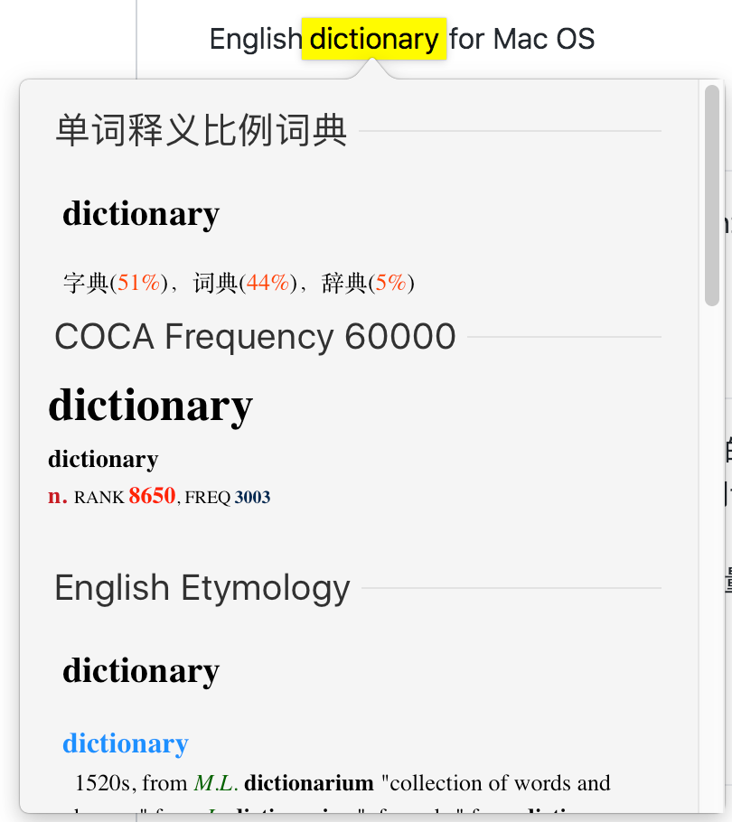

# Mdict2MacDict
 some English dictionaries for Mac OS

## Usage

Download the dictionary you like and unzip it to `~/Library/Dictionaries`. You can also **Open Dictionaries Folder** on your Mac's Dictionary app.

## Background

自己用 MarginNote 阅读英文著作，不懂的单词就三指点击（个人感觉相比其余软件，还是原生的词典方便、适应范围广），看下词频和简短的汉语释义（因为重点在阅读，仔细找释义会过分打断思路），若符合设定的词频，就标注原句和单词，再统一导出为 Anki 包。大部头的词典我也有转过，后来发现在快速取词界面里，释文太长，阅读过程中不方便，就弃用了。（导出到 Anki 里可以用 [FastWordQuery](https://github.com/sth2018/FastWordQuery) 等插件批量查词，支持的词典格式是 Mdict）

## Tool

converted by [ilius/pyglossary](https://github.com/ilius/pyglossary/) 

## See More

原对应 Mdict 词典可以看：

[COCA Frequency 60000【增强版】mdd - MDict 词库资源区 · MDX Dictionary - 掌上百科 - Powered by Discuz!](https://www.pdawiki.com/forum/thread-21073-1-1.html?x=286670)

[单词释义比例词典（2017-4-26 更新 v3 增加词性比例） - MDict 词库资源区 · MDX Dictionary - 掌上百科](https://www.pdawiki.com/forum/thread-20533-1-1.html?x=286670)

欲搜索更多词典,请查看论坛：

(论坛里有转换的一些大部头词典，如柯林斯等，因涉嫌版权问题，不转发在此处)

[掌上百科 - Powered by Discuz!](https://www.pdawiki.com/forum/?fromuid=286670)
